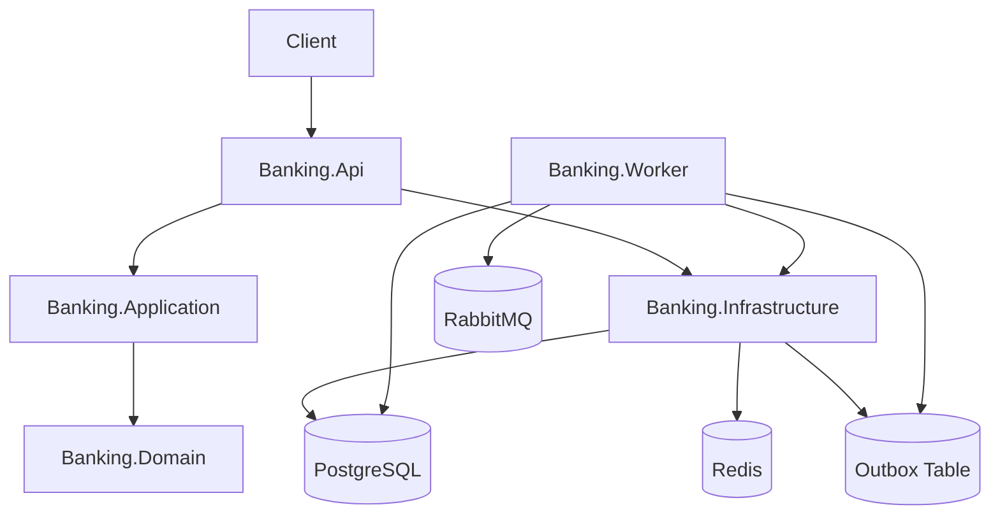
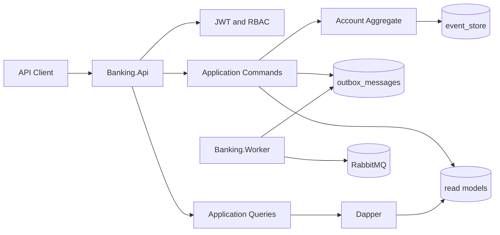
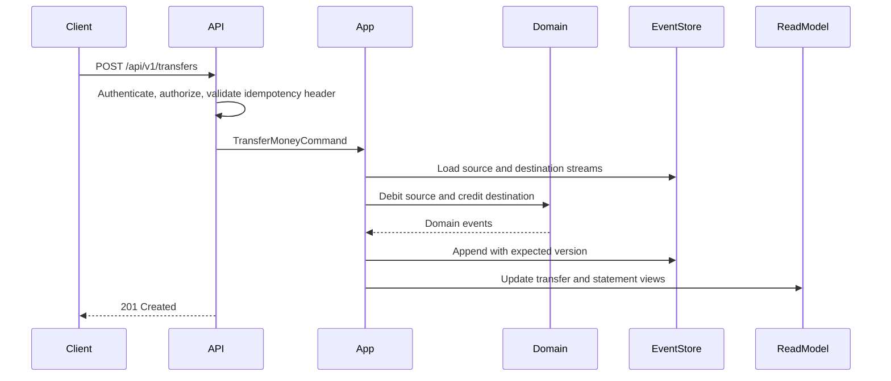
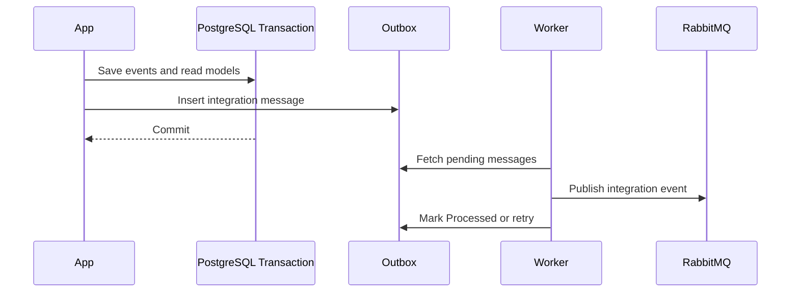

# Banking API Testing

## Overview

**Banking API Testing** es un proyecto académico desarrollado en el marco de la asignatura de **Calidad de Software de la Corporación Unificada Nacional de Educación Superior (CUN)**, como parte de la **Actividad de Construcción Aplicada (ACA)** orientada al diseño y elaboración de pruebas para la validación de software.

El proyecto surge con el propósito de aplicar de manera práctica los conceptos relacionados con **testing de software, aseguramiento de la calidad, validación funcional, diseño de casos de prueba y análisis de riesgos**, trasladándolos a un escenario realista de alta relevancia para la ingeniería de software: los **servicios transaccionales de un sistema bancario**.

La actividad académica establece la necesidad de seleccionar un sistema de información o un proyecto de software existente y utilizarlo como objeto de evaluación, con el fin de diseñar y ejecutar pruebas que permitan identificar comportamientos esperados, posibles fallos, riesgos y oportunidades de mejora. Dentro de este contexto, se seleccionó una API bancaria desarrollada sobre .NET como sistema base para realizar el proceso de evaluación y aplicar diferentes estrategias de pruebas de software. :contentReference[oaicite:2]{index=2}

El desarrollo del proyecto se encuentra orientado bajo el acompañamiento académico del **Ingeniero Jonathan Rincón**, dentro del contexto formativo de la CUN. La finalidad no es únicamente demostrar que una API puede ejecutar correctamente sus operaciones, sino evidenciar cómo un proceso sistemático de **aseguramiento de calidad** permite determinar si el software cumple los requisitos definidos, mantiene sus invariantes de negocio y responde adecuadamente ante escenarios normales, excepcionales y potencialmente riesgosos.

### Propósito académico

El propósito principal de **Banking API Testing** es llevar los conocimientos teóricos de calidad de software a un entorno práctico, utilizando una aplicación transaccional como objeto de estudio y construyendo sobre ella un proceso de pruebas técnicamente documentado.

De acuerdo con los objetivos establecidos para la ACA, el proyecto busca fortalecer la capacidad para:

- Reconocer la importancia de las pruebas dentro del ciclo de vida del software.
- Identificar diferentes tipos de pruebas utilizados en procesos de aseguramiento de calidad.
- Diseñar pruebas aplicables a un sistema de información.
- Elaborar y documentar casos de prueba.
- Analizar técnicamente los resultados obtenidos.
- Identificar posibles fallos y riesgos del sistema.
- Formular recomendaciones de mejora a partir de los resultados de las pruebas. :contentReference[oaicite:3]{index=3}

En consecuencia, este repositorio no debe entenderse únicamente como el código fuente de una API bancaria. Constituye también el espacio técnico utilizado para **diseñar, ejecutar, documentar y evidenciar un proceso de calidad de software**.

### ¿Por qué un sistema bancario?

Los sistemas bancarios representan un escenario especialmente apropiado para estudiar la calidad del software debido a la naturaleza crítica de las operaciones que ejecutan.

Una operación aparentemente sencilla como realizar un depósito o una transferencia implica múltiples condiciones que deben cumplirse correctamente. El sistema debe validar la identidad del usuario, verificar el estado de las cuentas, controlar los valores involucrados, evitar inconsistencias en los saldos, garantizar que una operación no sea procesada accidentalmente dos veces y mantener la trazabilidad de los movimientos realizados.

Un defecto en este tipo de sistemas puede generar consecuencias mucho más importantes que un error convencional de una aplicación. Una falla en una operación financiera puede producir inconsistencias de información, movimientos duplicados, saldos incorrectos o pérdida de trazabilidad.

Por esta razón, el dominio bancario permite demostrar de manera concreta la importancia de implementar pruebas de software antes de considerar un sistema listo para ser utilizado en un entorno productivo.

### Contexto del proyecto

La selección de este sistema también responde a la necesidad de trabajar sobre un escenario cercano a los problemas que pueden encontrarse en ambientes empresariales modernos de integración y servicios.

La API implementa diferentes operaciones relacionadas con cuentas y movimientos financieros, permitiendo utilizar estas funcionalidades como base para construir escenarios de prueba.

Entre las operaciones contempladas se encuentran:

- Autenticación de usuarios.
- Gestión de cuentas bancarias.
- Activación y desactivación de cuentas.
- Depósitos.
- Transferencias.
- Consulta de movimientos.
- Generación y consulta de extractos.
- Control de operaciones financieras mediante mecanismos de idempotencia.

A partir de estas funcionalidades se pueden construir diferentes escenarios de prueba y analizar tanto el comportamiento esperado del sistema como sus respuestas ante entradas inválidas, operaciones no autorizadas, conflictos y condiciones excepcionales.

### Enfoque de calidad de software

El proyecto adopta un enfoque de calidad basado en la validación sistemática del comportamiento del sistema.

La intención no es limitar las pruebas a comprobar que una petición HTTP devuelve un código `200 OK`. Una prueba de calidad debe determinar si el sistema **hace lo correcto**, bajo las condiciones correctas y también qué ocurre cuando las condiciones no son las esperadas.

Por esta razón, el proyecto contempla diferentes categorías de validación, entre ellas:

- Pruebas funcionales.
- Pruebas de integración.
- Pruebas negativas.
- Pruebas de seguridad.
- Pruebas de rendimiento.
- Validación de reglas de negocio.
- Validación de idempotencia.
- Validación de concurrencia.
- Validación de consistencia de las operaciones financieras.

Este enfoque permite pasar de una validación superficial de endpoints a una estrategia de pruebas orientada al comportamiento real del sistema.

### Alcance de la ACA

La actividad académica establece como parte de su desarrollo la realización de pruebas sobre el software seleccionado, la construcción de casos de prueba y la elaboración de un documento técnico que incluya el sistema evaluado, objetivo, tipo de prueba, alcance, requerimientos, escenarios, casos de prueba, datos de entrada, resultados esperados y obtenidos, además de evidencias. :contentReference[oaicite:4]{index=4}

También se solicita realizar un análisis crítico orientado a identificar posibles fallos, riesgos, recomendaciones de mejora y la importancia de las pruebas antes de una implementación final. :contentReference[oaicite:5]{index=5}

Por lo tanto, este repositorio se plantea como una extensión práctica de dichos requerimientos, permitiendo conservar no solamente el software utilizado como objeto de estudio, sino también la documentación, pruebas automatizadas, evidencias y demás artefactos relacionados con el proceso de aseguramiento de calidad.

### Objetivo del proyecto

El objetivo de **Banking API Testing** es diseñar y desarrollar una estrategia de pruebas de software aplicada a una API transaccional bancaria, con el propósito de validar sus funcionalidades, reglas de negocio, integridad de las operaciones y comportamiento ante diferentes escenarios de ejecución.

El proyecto busca demostrar que la calidad de un sistema no depende exclusivamente de que el código compile o de que un endpoint responda correctamente, sino de la capacidad del software para mantener un comportamiento confiable, consistente y verificable frente a las condiciones para las cuales fue diseñado.

### Naturaleza del sistema

La API bancaria utilizada en este proyecto tiene carácter **educativo y experimental**. Las operaciones financieras representan transacciones simuladas dentro de un entorno controlado de desarrollo y pruebas.

El proyecto **no se encuentra conectado con Banco Popular, Banco de la República, Banco Central, ACH Colombia, Transfiya, PSE, PIX ni ninguna otra red de pagos o infraestructura financiera real**.

De igual manera, las cuentas, usuarios, saldos, movimientos y credenciales utilizadas durante las pruebas corresponden exclusivamente al entorno de demostración.

El objetivo es utilizar el dominio financiero como escenario técnico para estudiar y demostrar prácticas de desarrollo, integración y aseguramiento de calidad de software.

## Business Rules

Las principales reglas de negocio utilizadas como base para las pruebas son:

- El saldo de una cuenta nunca debe ser negativo.
- Las cuentas nuevas deben iniciar activas y con saldo cero.
- Las cuentas inactivas no pueden enviar ni recibir dinero.
- Las operaciones financieras requieren un `Idempotency-Key`.
- Una misma clave de idempotencia utilizada con la misma solicitud debe retornar la respuesta original.
- Una misma clave de idempotencia utilizada con una solicitud diferente debe generar un `409 Conflict`.
- Los clientes únicamente pueden operar sobre sus propias cuentas.
- Los usuarios administradores pueden activar, desactivar y consultar cuentas.
- Los usuarios administradores no pueden ignorar las invariantes financieras del sistema.
- El Event Store constituye la fuente de verdad para los movimientos financieros.
- Las tablas de cuentas y extractos funcionan como modelos de lectura y no como fuente primaria de verdad financiera.

## Architecture



## Solution Architecture

The solution is organized into several layers, following a Clean Architecture approach that separates business rules, application use cases, infrastructure concerns, and API delivery.

This architecture is especially relevant for the software quality evaluation because the separation of responsibilities allows the different components of the system to be tested independently and also makes it possible to validate their interaction through integration and end-to-end tests.

The solution is split into:

- `Banking.Domain`: contains the core domain model, value objects, aggregate invariants, and domain events. This layer represents the business rules that must remain consistent regardless of the infrastructure or communication mechanism used by the system.

- `Banking.Application`: contains use case contracts, DTOs, CQRS command and query structures, and interfaces required by the application layer. It coordinates the execution of business operations while maintaining separation between application logic and infrastructure.

- `Banking.Infrastructure`: contains the technical implementations required by the application, including Entity Framework Core, PostgreSQL Event Store, Dapper queries, read models, authentication persistence, idempotency, PIX simulation persistence, and Outbox persistence.

- `Banking.Api`: exposes the system through HTTP endpoints and is responsible for controllers, JWT Bearer authentication, authorization, ProblemDetails responses, correlation IDs, OpenTelemetry, Serilog logging, and health checks. This layer represents the main entry point used during API functional and integration testing.

- `Banking.Worker`: executes background processes related to the Transactional Outbox pattern using MassTransit and RabbitMQ. This component allows asynchronous processing and messaging scenarios to be evaluated as part of the integration and reliability testing strategy.

The separation between these components makes it possible to evaluate the system at different levels, from isolated business rules to complete transactional flows involving the API, database, messaging infrastructure, and background processes.

## Tech Stack

The project uses the following technologies and tools:

- .NET 8
- ASP.NET Core Web API
- PostgreSQL
- Entity Framework Core
- Dapper
- Redis
- RabbitMQ
- MassTransit
- JWT Bearer Authentication
- xUnit
- FluentAssertions
- NetArchTest
- Testcontainers
- Serilog
- OpenTelemetry
- Docker Compose
- GitHub Actions
- k6

These technologies are not only part of the application implementation but also provide the technical foundation for the quality assurance strategy.

The testing ecosystem allows the project to validate different quality attributes, including functional correctness, integration between components, architectural conformance, authentication and authorization behavior, transactional consistency, idempotency, and performance.

## Testing and Quality Approach

The architecture allows the project to apply a layered testing strategy instead of validating the system exclusively through individual HTTP requests.

The testing approach considers different levels of validation:

- **Unit Testing:** validation of isolated business rules, domain behavior, application logic, and individual components.

- **Integration Testing:** validation of the interaction between the API and external infrastructure such as PostgreSQL, Redis, RabbitMQ, and other required services.

- **Functional Testing:** validation of API endpoints according to their expected functional behavior, including successful operations and expected error responses.

- **Negative Testing:** validation of invalid inputs, unauthorized operations, inactive accounts, insufficient balances, duplicated requests, invalid identifiers, and other exceptional scenarios.

- **Security Testing:** validation of authentication, authorization, ownership restrictions, JWT Bearer authentication, and protection of financial operations.

- **Architectural Testing:** validation of the expected dependency and architectural boundaries using tools such as NetArchTest.

- **Performance Testing:** evaluation of the API behavior under different workloads using k6, with emphasis on response times, throughput, and system stability.

- **End-to-End Validation:** verification of complete business flows involving multiple application components and infrastructure services.

This strategy allows the project to move beyond the simple verification that an endpoint returns an HTTP status code and instead evaluate whether the complete system behaves correctly under different operational conditions.

## Why This Architecture?

The project intentionally goes beyond a traditional CRUD application because financial transaction systems require stronger guarantees regarding consistency, traceability, authorization, retry safety, and reliability.

The architecture establishes clear boundaries between the domain, application, infrastructure, and API layers. This separation makes the system easier to understand, maintain, test, and evolve.

Financial operations are received through the REST API and processed through the application layer, where the corresponding use cases are executed. The domain layer protects the business invariants that must always be preserved, while the infrastructure layer provides persistence, messaging, authentication, and other technical capabilities.

From a software quality perspective, these boundaries are particularly important because they allow failures to be isolated and analyzed according to the component in which they occur.

For example, a failure in a financial transaction can be evaluated from several perspectives:

- Was the API request correctly validated?
- Was the user properly authenticated?
- Was the user authorized to operate on the account?
- Were the domain business rules respected?
- Was the transaction correctly persisted?
- Was the operation protected against duplicate requests?
- Was the event correctly recorded?
- Was the read model updated correctly?
- Was the message correctly published?
- Did the system maintain consistency after a failure or retry?

This approach allows the project to evaluate not only functional correctness but also important quality attributes of a transactional system.

## Architectural Patterns and Their Quality Relevance

### Event Sourcing

Event Sourcing is used to maintain the history of financial movements as events rather than relying exclusively on the current state of an account.

From a quality perspective, this provides greater traceability of financial operations and makes it possible to verify whether the sequence of events generated by a transaction corresponds to the expected business behavior.

### CQRS

Command Query Responsibility Segregation separates operations that modify the system from operations responsible for retrieving information.

This separation allows write operations and read operations to be tested independently while also validating the consistency of the information exposed through the read models.

### Transactional Outbox

The Transactional Outbox pattern is used to prevent a successful database transaction from becoming dependent on the immediate availability of the message broker.

The pattern is particularly relevant to reliability testing because it allows scenarios involving failures, retries, delayed message publication, and asynchronous processing to be evaluated.

### Idempotency

Financial operations require protection against accidental duplication, especially when clients retry requests due to network failures or timeouts.

The `Idempotency-Key` mechanism allows the testing strategy to verify that:

- Repeating the same request with the same idempotency key does not create a second financial operation.
- Repeating a request with the same key but different data is rejected.
- The original operation response can be returned safely.
- Financial consistency is maintained during retries.

### Optimistic Concurrency

Optimistic concurrency helps protect the system when multiple operations attempt to modify the same financial resource.

This mechanism provides an important scenario for integration and concurrency testing, allowing the project to evaluate how the system behaves when simultaneous operations compete for the same account state.

## Relationship Between Architecture and the ACA

The architecture of the solution provides the technical foundation for the quality assurance activities developed as part of the ACA.

The project uses the banking system as the software under evaluation and applies a structured testing process to identify expected behavior, exceptional scenarios, possible defects, and risks.

The architectural separation facilitates the construction of test scenarios and allows evidence to be obtained at different levels of the system.

Therefore, the objective of the project is not limited to demonstrating that the Banking API works. The objective is to establish whether the software behaves correctly according to its defined requirements and business rules, and to provide documented evidence that supports the conclusions obtained during the testing process.

The resulting repository combines the application source code with the artifacts required for the software quality process, including automated tests, documentation, test scenarios, performance tests, execution evidence, and analysis of the results.

## System Design Diagram



## Request Flow



## Event Flow



## Database Model

El modelo de datos está diseñado para soportar las operaciones transaccionales del sistema bancario y, al mismo tiempo, permitir la evaluación de diferentes atributos de calidad de software.

Las principales tablas y estructuras son:

- `users`: información de los usuarios registrados en el sistema.
- `refresh_tokens`: gestión de tokens utilizados para renovar sesiones autenticadas.
- `accounts_read_model`: proyección optimizada para las consultas relacionadas con las cuentas.
- `transfers_read_model`: proyección utilizada para consultar las transferencias realizadas.
- `pix_keys`: almacenamiento de las llaves PIX asociadas a las cuentas.
- `statement_entries_read_model`: proyección utilizada para la consulta de movimientos y extractos.
- `event_store`: almacenamiento de los eventos que representan los cambios financieros del sistema.
- `outbox_messages`: mensajes pendientes de publicación hacia los sistemas de integración.
- `idempotency_records`: registros utilizados para garantizar la seguridad de las operaciones frente a reintentos.

Las tablas `accounts_read_model` y `statement_entries_read_model` funcionan como modelos de lectura optimizados para las consultas y pantallas operativas. Estas estructuras no constituyen la fuente de verdad financiera del sistema.

El diseño busca separar claramente las responsabilidades entre los datos utilizados para realizar operaciones financieras, los datos utilizados para consulta y los mecanismos necesarios para garantizar consistencia, trazabilidad e integración.

## Event Store Design

El `event_store` constituye uno de los componentes principales del modelo de persistencia financiera. Su diseño sigue un enfoque de almacenamiento de eventos de tipo append-only, evitando modificar o eliminar los eventos históricos que representan las operaciones realizadas.

Cada evento contiene información relacionada con:

- Identidad y tipo del agregado al que pertenece.
- Tipo de evento.
- Versión del evento.
- Versión del agregado.
- Payload almacenado en formato JSON.
- Metadatos asociados a la operación.
- Información de correlación y causalidad.
- Usuario responsable de la operación.
- Fecha y hora en la que ocurrió el evento.

Una restricción única sobre `aggregate_id + aggregate_version` permite implementar un mecanismo de control de concurrencia optimista.

De esta manera, cuando dos operaciones concurrentes intentan registrar simultáneamente el siguiente evento de un mismo agregado, solamente una puede establecer correctamente la nueva versión. La operación que detecta que la versión esperada ya fue utilizada debe ser rechazada mediante un conflicto de concurrencia.

Este mecanismo es especialmente importante en el contexto del proyecto de Calidad de Software, debido a que permite evaluar el comportamiento del sistema frente a múltiples operaciones financieras ejecutadas de manera simultánea.

## API Contracts

La API utiliza versionamiento mediante el prefijo `/api/v1`, permitiendo mantener contratos claros y facilitar la evolución futura del servicio.

### Authentication

- `POST /api/v1/auth/register`
- `POST /api/v1/auth/login`
- `POST /api/v1/auth/refresh`
- `POST /api/v1/auth/logout`

### Accounts

- `POST /api/v1/accounts`
- `GET /api/v1/accounts`
- `GET /api/v1/accounts/{accountId}`
- `PATCH /api/v1/accounts/{accountId}/activate`
- `PATCH /api/v1/accounts/{accountId}/deactivate`

### Financial Operations

- `POST /api/v1/deposits`
- `POST /api/v1/transfers`
- `GET /api/v1/transfers/{transferId}`

### PIX

- `POST /api/v1/pix/keys`
- `GET /api/v1/pix/keys`
- `POST /api/v1/pix/payments`

### Statements

- `GET /api/v1/accounts/{accountId}/statement?from=&to=&page=&pageSize=`

### Health Checks

- `GET /health/live`
- `GET /health/ready`

Las operaciones financieras que modifican el estado del sistema requieren un encabezado de idempotencia:

```http
Idempotency-Key: unique-operation-key
```

## Testing Strategy

La estrategia de pruebas constituye uno de los componentes centrales del proyecto, debido a que el objetivo principal dentro de la asignatura de Calidad de Software de la Corporación Unificada Nacional de Educación Superior (CUN) no es únicamente construir una API funcional, sino establecer un entorno que permita aplicar, ejecutar y analizar diferentes técnicas de aseguramiento de la calidad.

El sistema utiliza un enfoque de pruebas por diferentes niveles, buscando validar tanto el comportamiento individual de los componentes como la interacción entre ellos y el comportamiento del sistema completo bajo condiciones controladas.

La estrategia contempla:

- Pruebas unitarias sobre el dominio para validar reglas relacionadas con dinero, ciclo de vida de las cuentas, depósitos, débitos, transferencias y eventos de dominio.
- Pruebas de arquitectura para verificar el cumplimiento de las dependencias definidas por Clean Architecture.
- Pruebas de integración utilizando Testcontainers para levantar instancias controladas de PostgreSQL, Redis y RabbitMQ.
- Pruebas de integración de API para los principales procesos de autenticación, cuentas, depósitos, transferencias, PIX, extractos y escritura de mensajes en Outbox.
- Pruebas de idempotencia para comprobar el comportamiento del sistema frente a solicitudes repetidas.
- Pruebas de concurrencia para evaluar múltiples operaciones financieras ejecutadas simultáneamente sobre una misma cuenta.
- Pruebas orientadas a validar las reglas de negocio y los invariantes financieros.
- Pruebas de rendimiento mediante escenarios controlados de operaciones transaccionales y consultas.

La estrategia busca evaluar diferentes atributos de calidad, entre ellos:

- Corrección funcional.
- Integridad de la información.
- Confiabilidad.
- Seguridad.
- Trazabilidad.
- Mantenibilidad.
- Rendimiento.
- Capacidad de recuperación ante reintentos.
- Comportamiento bajo concurrencia.

Uno de los escenarios de mayor relevancia consiste en verificar que las operaciones concurrentes no puedan generar un saldo negativo.

El escenario planteado es:

```txt
Given balance = 100

When 10 concurrent transfers of 30 are requested

Then only 3 succeed

And final balance = 10

And no negative balance exists

And failed transfers return 409 Conflict