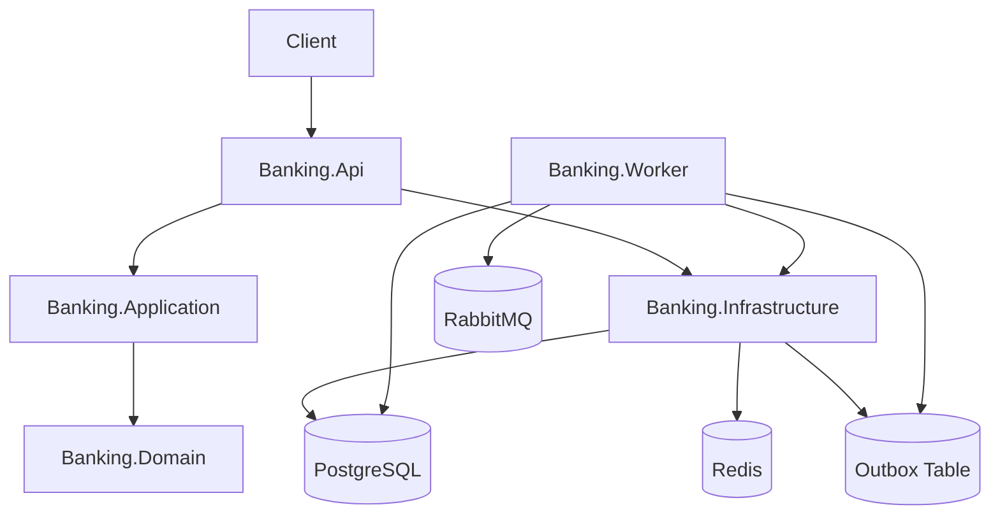
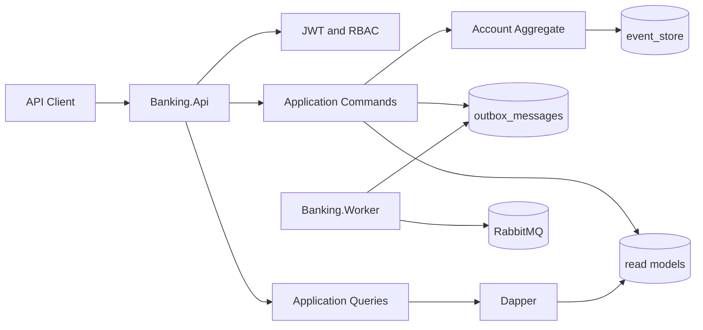
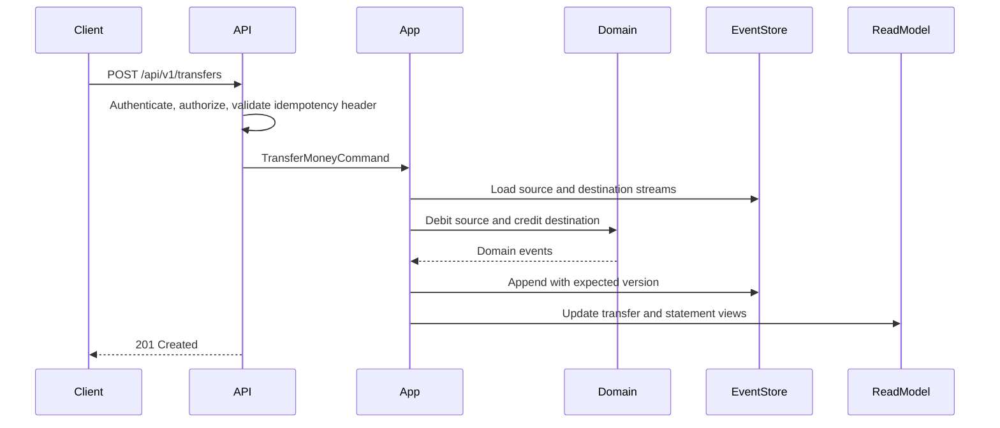
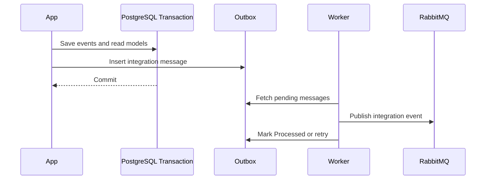

# Banking API

## Overview

Banking API is a .NET 8 educational banking system built to demonstrate senior backend engineering practices in a compact, runnable codebase. It uses Clean Architecture, DDD, CQRS, Event Sourcing, Transactional Outbox, idempotent financial operations, optimistic concurrency, observability, integration testing strategy, Docker, and CI/CD automation.

PIX is simulated for educational purposes. The project does not integrate with Banco Central or any real payment network.

## Business Rules

- Account balance must never become negative.
- New accounts start active with a zero balance.
- Inactive accounts cannot send or receive money.
- Financial operations require an `Idempotency-Key`.
- The same idempotency key with the same request returns the original response.
- The same idempotency key with a different request returns `409 Conflict`.
- Customers can operate only their own accounts.
- Admin users can activate, deactivate, and inspect accounts, but cannot bypass financial invariants.
- The Event Store is the source of truth for financial movements.
- Statement and account tables are read models, not the financial source of truth.

## Architecture



The solution is split into:

- `Banking.Domain`: pure domain model, value objects, aggregate invariants, and domain events.
- `Banking.Application`: use case contracts, DTOs, CQRS command/query shapes, and infrastructure interfaces.
- `Banking.Infrastructure`: EF Core, PostgreSQL Event Store, Dapper queries, read models, auth persistence, idempotency, PIX persistence, and Outbox persistence.
- `Banking.Api`: HTTP controllers, JWT bearer authentication, authorization, ProblemDetails, correlation ID, OpenTelemetry, Serilog, and health checks.
- `Banking.Worker`: background Outbox publisher using MassTransit and RabbitMQ.

## Tech Stack

- .NET 8
- ASP.NET Core Web API
- PostgreSQL
- EF Core
- Dapper
- Redis
- RabbitMQ
- MassTransit
- JWT Bearer
- xUnit
- FluentAssertions
- NetArchTest
- Testcontainers
- Serilog
- OpenTelemetry
- Docker Compose
- GitHub Actions
- k6

## Why This Architecture?

The project is intentionally more than CRUD. Financial systems need strong invariants, auditability, retry safety, and explicit consistency boundaries. The API accepts REST requests at the edge, routes writes through application services, protects invariants in the domain aggregate, persists append-only events, and updates read models for query performance.

Event Sourcing gives auditability and replayability for account movements. CQRS keeps write rules separate from read optimization. Transactional Outbox prevents a successful database transaction from being coupled to an unreliable broker publish. Idempotency keys make client retries safe.

## System Design Diagram



## Request Flow



## Event Flow



## Database Model

Core tables:

- `users`
- `refresh_tokens`
- `accounts_read_model`
- `transfers_read_model`
- `pix_keys`
- `statement_entries_read_model`
- `event_store`
- `outbox_messages`
- `idempotency_records`

`accounts_read_model` and `statement_entries_read_model` are optimized projections. They support reads and operational screens, but they are not the source of truth for financial balances.

## Event Store Design

The `event_store` table is append-only and contains:

- aggregate identity and type;
- event type and event version;
- aggregate version;
- JSON payload;
- metadata containing correlation, causation, and user information;
- occurrence timestamp.

The unique constraint on `aggregate_id + aggregate_version` is the core optimistic concurrency guard. If two requests try to append the next event for the same account, one wins and the other receives a conflict.

## API Contracts

Versioned endpoints use `/api/v1`.

- `POST /api/v1/auth/register`
- `POST /api/v1/auth/login`
- `POST /api/v1/auth/refresh`
- `POST /api/v1/auth/logout`
- `POST /api/v1/accounts`
- `GET /api/v1/accounts`
- `GET /api/v1/accounts/{accountId}`
- `PATCH /api/v1/accounts/{accountId}/activate`
- `PATCH /api/v1/accounts/{accountId}/deactivate`
- `POST /api/v1/deposits`
- `POST /api/v1/transfers`
- `GET /api/v1/transfers/{transferId}`
- `POST /api/v1/pix/keys`
- `GET /api/v1/pix/keys`
- `POST /api/v1/pix/payments`
- `GET /api/v1/accounts/{accountId}/statement?from=&to=&page=&pageSize=`
- `GET /health/live`
- `GET /health/ready`

Financial write endpoints require:

```http
Idempotency-Key: unique-operation-key
```

## Authentication and Authorization

The API implements JWT bearer authentication, refresh tokens, RBAC, and ownership checks.

Roles:

- `Customer`
- `Admin`

JWT claims:

- `sub`
- `email`
- `role`
- `jti`

Customers can open accounts, deposit to their own accounts, transfer from their own accounts, register PIX keys for their own accounts, and view their own statement. Admins can inspect and manage account status, but still cannot violate domain rules.

## Idempotency Strategy

Financial operations store an idempotency record keyed by:

```txt
user_id + operation_type + idempotency_key
```

The record contains a request hash, status code, response payload, creation time, and expiration. Retrying the same key with the same payload returns the stored response. Reusing the key with a different payload returns `409 Conflict`.

## Concurrency Strategy

Consistency relies on PostgreSQL transactions, append-only event streams, unique constraints, and expected aggregate version checks.

Required concurrency scenario:

```txt
Given balance = 100
When 10 concurrent transfers of 30 are requested
Then only 3 succeed
And final balance = 10
And no negative balance exists
And failed transfers return 409 Conflict
```

Redis may be introduced for optimization, but it must not be the only consistency mechanism and must never become the financial source of truth.

## Outbox Strategy

Application services enqueue integration messages in `outbox_messages` in the same database transaction as the financial operation. `Banking.Worker` publishes pending messages to RabbitMQ through MassTransit, marks successful messages as `Processed`, retries failures, and eventually marks exhausted messages as `Failed`.

Command handlers do not publish directly to RabbitMQ.

## Observability

The API includes:

- Serilog structured logs;
- correlation ID middleware using `X-Correlation-ID`;
- OpenTelemetry traces and metrics;
- health checks at `/health/live` and `/health/ready`;
- Swagger/OpenAPI at `/swagger`;
- rate limiting with `429 Too Many Requests`;
- ProblemDetails error responses.

Correlation IDs are propagated through responses, logs, events, and Outbox metadata where applicable.

## Testing Strategy

Implemented:

- domain unit tests for money, account lifecycle, deposits, debits, transfers, and domain events;
- architecture tests enforcing Clean Architecture references;
- Testcontainers integration tests with PostgreSQL, Redis, and RabbitMQ;
- API integration tests for auth, accounts, deposits, transfers, PIX, statement, and Outbox writes;
- idempotency integration tests;
- concurrent transfer tests covering the required two-transfer and ten-transfer scenarios.

The most important test proves that concurrent transfers cannot create a negative balance.

## Performance Considerations

Targets:

- `GET /statement` p95 under 300ms with 10k records;
- `POST /transfers` p95 under 500ms under moderate load;
- zero duplicate transfers under retry;
- zero negative balances under concurrency.

The `performance` folder contains starter k6 scripts for transfer and statement scenarios. These scripts are intended to be run against a locally seeded environment.

## How to Run Locally

Start dependencies and services:

```bash
docker compose up --build
```

If a default port is already in use, override it before starting Compose:

```bash
POSTGRES_PORT=15432 docker compose up --build
```

On PowerShell, the following starts an isolated local instance without changing
the Compose file. It is useful when other learning projects already use the
default ports:

```powershell
$env:API_PORT='15000'
$env:POSTGRES_PORT='15432'
$env:REDIS_PORT='16379'
$env:RABBITMQ_PORT='15673'
$env:RABBITMQ_MANAGEMENT_PORT='15674'
docker compose up --build -d
```

Verify the local instance at:

- API health: `http://localhost:15000/health/live`
- Swagger: `http://localhost:15000/swagger`
- RabbitMQ management: `http://localhost:15674`

For a recorded, reproducible local validation, see
[`docs/local-run-evidence.md`](docs/local-run-evidence.md).

Run only the API from source:

```bash
dotnet run --project src/Banking.Api/Banking.Api.csproj
```

Run only the Worker from source:

```bash
dotnet run --project src/Banking.Worker/Banking.Worker.csproj
```

The RabbitMQ management UI is exposed by Docker Compose.

Development seeds are applied when `Banking.Api` runs in `Development`:

- `customer@test.com` / `Password123!`
- `admin@test.com` / `Password123!`

## How to Run Tests

```bash
dotnet restore
dotnet build
dotnet test tests/Banking.UnitTests/Banking.UnitTests.csproj
dotnet test tests/Banking.ArchitectureTests/Banking.ArchitectureTests.csproj
dotnet test tests/Banking.IntegrationTests/Banking.IntegrationTests.csproj
```

Run all tests:

```bash
dotnet test
```

## CI/CD Pipeline

GitHub Actions runs:

- restore;
- release build;
- format verification;
- unit tests;
- integration tests;
- architecture tests;
- Docker Compose build.

## Trade-offs

- Event Sourcing is used for financial movements, but the project is still a single deployable system rather than distributed microservices.
- Read models are updated inside application flows before introducing a full asynchronous projection pipeline.
- PIX is simulated to keep scope educational and avoid external regulatory integrations.
- Redis is present in the architecture for cache, idempotency lookup, rate limiting, and optional lock optimization, but PostgreSQL remains the consistency boundary.
- The Outbox worker is deliberately simple and can evolve into richer retry policies, dead-letter handling, and observability dashboards.

## Future Improvements

- Add MFA.
- Add a real OpenID Connect provider.
- Add Keycloak or Auth0 integration.
- Add Saga or Process Manager support for distributed transfers.
- Add Kafka support.
- Add Kubernetes manifests.
- Add multi-tenant support.
- Add advanced fraud detection.
- Add a real ledger accounting model.
- Add an admin dashboard.
- Add real PIX or Open Banking integration.
